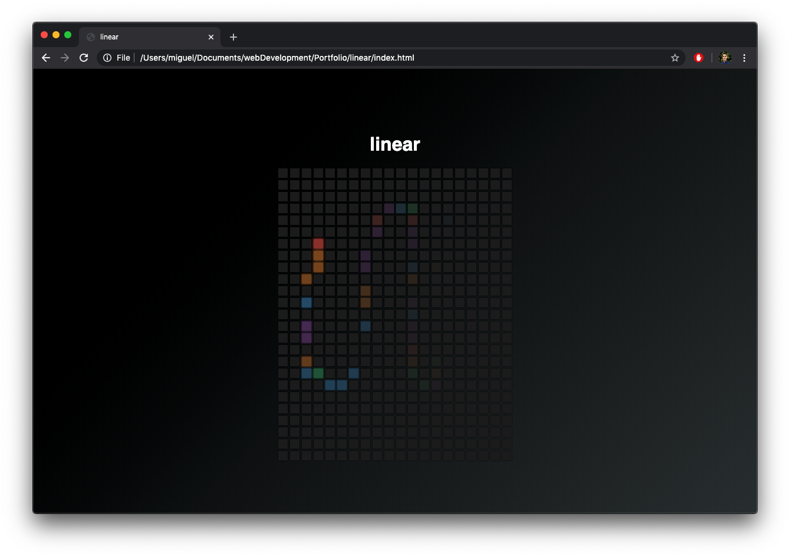

# linear: A fun page where you can draw fun lines with your cursor.
by mrivasperez live demo: <https://mrivasperez.github.io/linear/>

## Screenshot

## Description
This is a static page JavaScript app I made to practice my JS DOM skills and create something for people to relax with. It is built with HTML, CSS, and VanillaJS

## Installation
You can view the webpage by visiting https://mrivasperez.github.io/linear/. Alternately, to run this webpage locally, download the repository as a zip file. Create a new folder in your system then drag and drop the contents of the zip file to that new folder. Double click "index.html" to open the page.

## How to use
Open the page and hover the cursor over the squares. As you hover over the squares with your mouse, the squares will change color. After you move the mouse over the square they will slowly transition back to the default gray color. This transition effect gives the appearance as if there was a colorful trail behind your cursor.

